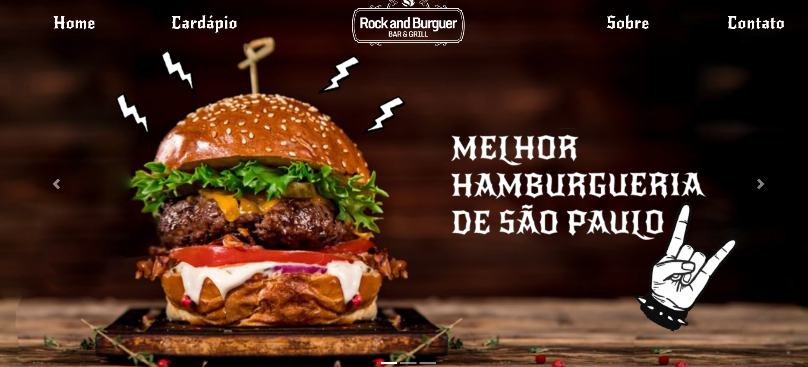

<h1 style="text-align:center; font-weight:bold;">
  Rock and Burger  
  Primeira atividade do Curso de Interfaces
</h1>

<h2 align="center">
  Atividade designada pela professora Debora Paixão
</h2>

 Tecnologias utilizadas:
         
         
        

<h2> Layout criado para o index.html</h2>
  

<h3>
  Realizada por:
   
  Paula Martins
   
  Guilherme Melo
   
  Laura Lopes
   
  David Oliveira
   
  Gustavo Saturnino
   
</h3>

